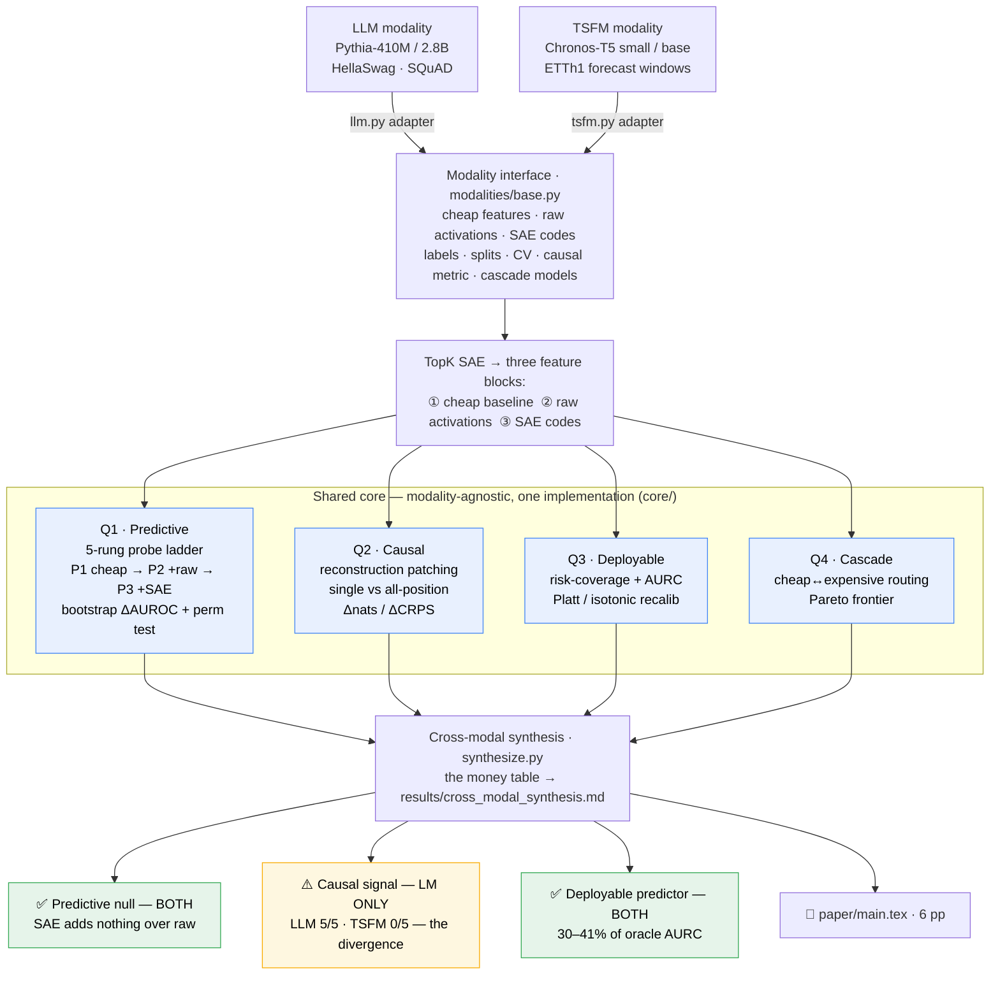

# fm-difficulty-probe

[](https://github.com/nabindev3/fm-difficulty-probe/actions/workflows/ci.yml)
[](LICENSE)
[](pyproject.toml)
[](CITATION.cff)

A modality-agnostic study of whether **TopK sparse-autoencoder features encode a
self-difficulty signal** in foundation models — replicated across an
autoregressive LM (Pythia) and an encoder-based time-series FM (Chronos-T5).

> This repo merges [`llm-sae-difficulty`](https://github.com/nabindev3/llm-sae-difficulty)
> (Pythia) and [`tsfm-sae-difficulty`](https://github.com/nabindev3/tsfm-sae-difficulty)
> (Chronos-T5) into one shared pipeline; see those for per-modality detail and the
> original workshop reports.

## Thesis (as tested) and what the data actually showed

**Going-in thesis.** Across an autoregressive LM and an encoder-based TSFM,
TopK-SAE features add **no incremental predictive power** for difficulty beyond
the strongest cheap baseline, yet carry a **(near-)significant causal
contribution** under reconstruction patching; the deployable artifact in both is
a selective predictor on the cheap baseline capturing **30–41% of oracle AURC**.

**What the unified runs showed.** Two of the three legs replicate cleanly; one
does not — and the divergence is the contribution:

> The **predictive null** and the **deployable selective predictor** replicate in
> BOTH modalities. The **causal contribution does not**: SAE features are causally
> active in the LM (5/5 features under all-position patching) but causally quiet
> in the TSFM (0/5 under either coverage, reproducing the legacy Chronos null).
> The causal signal is thus a property of the autoregressive LM, not a universal
> SAE phenomenon.

This is the roadmap's "either outcome is publishable" case: a *universal
predictive null + a modality-specific causal positive* is a sharper, more
falsifiable claim than a forced two-way replication.

## Pipeline at a glance

Two unrelated foundation models enter through thin adapters, run the *identical*
shared core, and meet in one cross-modal synthesis table.



The whole project rests on the **CORE** box being literally one implementation:
the cross-modal claim is apples-to-apples *by construction*, because Pythia and
Chronos run the same code through their adapters.

## Why this layout

The project lives or dies on whether **both modalities run the same pipeline and
report the same metrics**. So the code is split into:

- **`core/`** — modality-agnostic. Pure numpy/sklearn/torch-SAE. No model code.
  Unit-tested on synthetic arrays (`pytest tests/`).
- **`modalities/`** — thin adapters implementing one `Modality` interface
  (`modalities/base.py`). Each owns its model, dataset, features, and CV scheme.
- **`experiments/run.py`** — one config-driven entrypoint; no per-modality
  branches beyond picking the adapter.
- **`configs/`** — one YAML per (modality × experiment).

```
core/                modality-agnostic, numpy/sklearn/torch-SAE, no model code
  sae.py             TopK SAE (aux dead-feature revival; expansion & k configurable)
  probe.py           three-rung (+2 diagnostic) ladder, paired-bootstrap ΔAUROC
  calibration.py     ECE/Brier + Platt/isotonic 5-fold OOF recalibration
  selective.py       risk-coverage curves, AURC, oracle, "% of oracle captured"
  cascade.py         cheap↔expensive routing, Pareto frontier
  patching.py        reconstruction-patch ablation: single- AND all-position
  stats.py           ProbeResult, paired bootstrap, label-permutation test
  _repro.py          single-thread BLAS pin for bit-reproducibility
modalities/
  base.py            the Modality Protocol every backend satisfies
  llm.py             Pythia-410M/2.8B + HellaSwag / SQuAD
  tsfm.py            Chronos-T5 small/base + ETTh1 forecast windows
experiments/
  run.py             config-driven entrypoint (--modality / --experiment)
  causal_llm.py      Pythia causal ablation (all vs boundary position)
  causal_tsfm.py     Chronos causal ablation (all vs last; CRN variance reduction)
  train_sae.py       SAE trainer (for the expansion-robustness sweep)
  synthesize.py      builds the cross-modal money table
configs/             one YAML per (modality × experiment)
paper/               main.tex (6pp, builds) + references.bib + submission_materials.md
results/             json + parquet + PNG per experiment, + cross_modal_synthesis.md
pyproject.toml       installable package (`pip install -e .`) + pytest pythonpath
requirements.lock    exact pins of the env that produced the committed CIs
tests/               model-free core tests (synthetic ladder + causal patching)
```

## The probe ladder (the apples-to-apples comparator)

Both modalities report the identical five-rung ladder:

| rung | features | role |
|------|----------|------|
| `P1_cheap`     | cheap baseline (lexical stats \| classical TS stats) | floor |
| `P2_cheap_raw` | cheap + **raw activations** | the crucial middle rung |
| `P3_cheap_sae` | cheap + SAE codes | the claim under test |
| `P4_raw_only`  | raw activations only | diagnostic |
| `P5_sae_only`  | SAE codes only | diagnostic |

Headline number: **Δ(P3 − P2)** — SAE *over raw activations*, with a
paired-bootstrap CI and a label-permutation p-value. The reconciliation work
that makes this one paper is forcing **both** modalities through this exact
ladder (the legacy TSFM repo reported SAE-vs-classical-stats and kept the raw
middle rung only as a diagnostic; routing it through `core.probe` promotes it).

## Quickstart

```bash
# Editable install — puts core/ modalities/ experiments/ on the import path,
# so there are no sys.path hacks anywhere (see pyproject.toml).
pip install -r requirements.txt && pip install -e .
# For bit-reproducible runs that regenerate the committed CIs, install the exact
# pins instead:  pip install -r requirements.lock && pip install -e . --no-deps

pytest tests/ -q                 # model-free; proves the core is modality-agnostic
                                 # (works from a clean checkout via pyproject pythonpath)

# Roadmap interface: pick a backend + analysis stage.
python experiments/run.py --modality llm  --dataset squad --experiment all
python experiments/run.py --modality tsfm --experiment probe
python experiments/run.py --modality tsfm --experiment causal     # single vs all-position
# (or point at an explicit config: --config configs/llm_squad.yaml)

# Regenerate the entire results table end-to-end, unattended:
bash reproduce.sh                       # full table (LLM causal reused from legacy)
RUN_EXPANSION=1 bash reproduce.sh       # + SAE expansion-robustness sweep
REPROBE_LLM_CAUSAL=1 bash reproduce.sh  # + recompute LLM causal on Pythia
FAST=1 bash reproduce.sh                # probe table only (skip heavy causal)
```

Every experiment writes a uniform artifact pair — `<name>.json` (full detail) +
`<name>.parquet` (flat table) — plus PNG figures (risk-coverage, Pareto, reliability)
under `results/<experiment>/`. Runs are **bit-reproducible**: probes seed
liblinear (`random_state`), the entrypoints pin BLAS to a single thread
(`core/_repro.py`), and `requirements.lock` pins the numerics-critical packages
(numpy / scipy / scikit-learn / torch) to the versions that produced the
committed CIs — so a fresh `run.py` reproduces them exactly (set
`OMP_NUM_THREADS=8` to trade exact bits for speed). Guardrails: the runner refuses
a missing / non-TopKSAE / random-init checkpoint and single-class labels, and sets
the threading backend + MPS device for Apple Silicon. (Activation *extraction* and its
`--skip_predict` flag remain in the legacy `extract_activations.py`; this repo
starts from cached activations — see `configs/README.md` for staging.)

## Reproduced results (real runs, in `results/`)

Through the shared code, **both** modalities reproduce their legacy headline
numbers exactly (the Phase-2 regression gate): LLM SQuAD/L18 raw-only AUROC =
**0.716**; TSFM Δ(SAE−cheap) = **−0.228**; selective **41%** (LLM) / **30%** (TSFM).
(The default TSFM config uses the legacy whole-dataset label threshold; a
train-only threshold is an opt-in leakage fix that leaves the conclusion unchanged
— `SEAMS.md` §6.) Full table in `results/cross_modal_synthesis.md`:

| | HellaSwag | SQuAD (mid) | ETTh1 |
|---|---|---|---|
| P1 cheap AUROC | 0.509 | 0.590 | 0.654 |
| P2 cheap+raw   | 0.472 | 0.671 | 0.584 |
| P3 cheap+SAE   | 0.500 | 0.592 | 0.426 |
| **Δ SAE over raw** | +0.028 [−0.001,+0.058] | −0.079 [−0.118,−0.041] | −0.158 [−0.293,−0.025] |
| Δ SAE over cheap | −0.009 [−0.039,+0.020] | +0.002 [−0.044,+0.047] | −0.228 [−0.366,−0.092] |
| causal all-pos | 5/5 sig | 5/5 sig | **0/5 sig** |
| causal single-pos | 0/5 sig | 2/5 sig | **0/5 sig** |
| selective % oracle | 2.0% (P1) | 41.3% (raw) | 30.5% (P1) |

(SQuAD raw rung peaks at the late layer: P4 raw-only L18 = 0.716; run with
`--layer late`.)

**What replicates, and what doesn't — the actual cross-modal finding:**
1. **Predictive null — both.** SAE adds no power over the strongest cheap rung in
   either modality.
2. **Causal positive — LLM only.** On Pythia the top features are causally active
   under all-position patching (5/5) and under-detected by single-position (0–2/5:
   coverage, not fidelity). On Chronos **no** feature is significant under either
   coverage (0/5) — reproducing the legacy Chronos null (50-sample run also 0/5),
   so it's not a sample-budget artifact. The causal signal is a property of the
   autoregressive LM, not a universal SAE phenomenon.
3. **Deployable artifact — both.** A cheap-baseline selective predictor captures
   30–41% of oracle AURC (each modality on its natural error scale: binary
   correctness for the LLM, continuous CRPS for the TSFM).

That divergence (universal predictive null, LLM-specific causal contribution) is
the paper's contribution, not a problem — see `SEAMS.md` §2.

```bash
# causal coverage replication (needs the live models, cached locally):
USE_TF=0 python experiments/causal_tsfm.py --config configs/tsfm_etth1.yaml --positions all
USE_TF=0 python experiments/causal_tsfm.py --config configs/tsfm_etth1.yaml --positions last
python experiments/synthesize.py
```

The TSFM causal ablation defaults to **Common Random Numbers** (shared MC draws
across natural/recon/ablate per window) so the per-feature ΔCRPS isolates the
intervention from sampling noise; `--no_crn` reverts to the noisier legacy
estimator. The conclusion is invariant (0/5 either way); CRN just tightens the
null.

## Status / roadmap — all phases complete

- [x] **Phase 0** repo architecture (this layout)
- [x] **Phase 1** shared core extracted + unit-tested on synthetic arrays
- [x] **Phase 2** adapters wired against real extraction outputs; **both** modalities'
      legacy headline numbers reproduce exactly (regression gate: LLM 0.716, TSFM −0.228)
- [x] **Phase 3** seams closed — see `SEAMS.md`:
      (a) identical three-rung ladder in both modalities at **both** layers;
      (b) single- AND all-position causal on Chronos via `core.patching` (→ the divergence);
      (c) **expansion-robustness sweep** (LLM 4×↔8×, TSFM 8×↔4×): null holds at both widths.
      Plus a train-only-threshold leakage fix (opt-in) and natural-scale selective error.
- [x] **Phase 4** unified runner (`--modality`/`--experiment`, incl. `causal` &
      `calibrate`), uniform json+parquet+PNG artifacts, guardrails, bit-reproducible,
      and an unattended `reproduce.sh` that regenerates the full table
- [x] **Phase 5** cross-modal synthesis table (`results/cross_modal_synthesis.md`,
      auto-generated) — all axes populated incl. label-permutation p and cascade points
- [x] **Phase 6** manuscript: `paper/main.tex` (6pp, builds with `tectonic`) +
      `references.bib` + ready-to-paste `paper/submission_materials.md`

Docs: `SEAMS.md` (seam-by-seam reconciliation), `results/expansion_robustness.md`
(width sweep), `paper/outline.md` (manuscript skeleton). The only remaining work is
human-side: fill the `[GROUP]/[TOPIC]` slots in `submission_materials.md` and pick a venue.

## License

Dual-licensed, by artifact type:

- **Software** (`core/`, `modalities/`, `experiments/`, `tests/`, configs, build
  files) — MIT, see [`LICENSE`](LICENSE).
- **Manuscript** (`paper/`) — Creative Commons Attribution 4.0 (CC BY 4.0), see
  [`paper/LICENSE`](paper/LICENSE).

The rendered `paper/main.pdf` **is intentionally committed** (it is the headline
deliverable, ~68 KB, and a reader without a LaTeX toolchain should still get the
paper). This is deliberate and distinct from `results/`, which is gitignored
because it is large and fully regenerable from the code. To rebuild the PDF:
`cd paper && tectonic main.tex`.

## Citation

See [`CITATION.cff`](CITATION.cff) (GitHub renders a "Cite this repository"
button). Please cite both the software and the manuscript.
